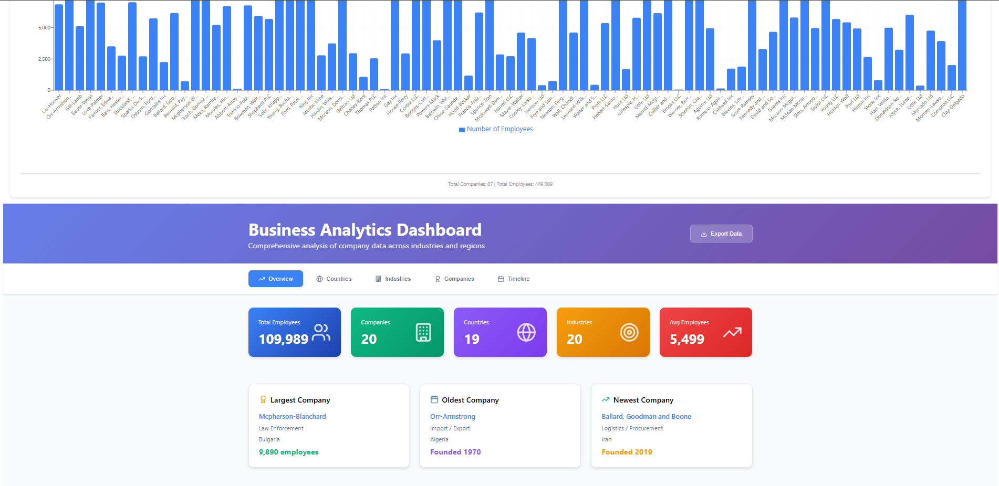

---

````markdown

# 📊 Custom Data Visualize Dashboard

(MongoDB, Express, React, Node.js) application for uploading CSV files, storing their data in MongoDB, uploading the original file to AWS S3, and visually displaying the parsed data using interactive bar charts. Change and update the code to match your own csv files. This code is made for the 'organizations-1000.csv' in the root directory. 


---

## 🧠 Features

- Upload `.csv` files from the frontend
- Parse CSV rows and store data in MongoDB Atlas
- Automatically upload the original CSV to an S3 bucket
- Visualize organization data (e.g., employee counts) using Recharts
- Fully local setup (nothing deployed yet)

---

## 🏗️ Tech Stack

- **Frontend**: React, Axios, Recharts
- **Backend**: Express, Node.js, Multer, csv-parser, AWS SDK
- **Database**: MongoDB Atlas (cloud MongoDB)
- **Storage**: AWS S3 (for saving uploaded files)

---

##  Getting Started

### 1. Clone the repository

```bash
git clone https://github.com/zayd100/delta.git
cd delta-viz
````

### 2. Install dependencies

#### Backend

```bash
cd backend
npm install
```

#### Frontend

```bash
cd frontend
npm install
```

### 3. Environment Setup

Create a `.env` file in the `backend/` directory:

```env
MONGO_URI=your_mongodb_connection_string
AWS_ACCESS_KEY_ID=your_aws_access_key
AWS_SECRET_ACCESS_KEY=your_aws_secret_key
AWS_REGION=your_aws_region (e.g., us-east-1)
AWS_S3_BUCKET_NAME=your_s3_bucket_name
```

> 🔒 Make sure you do **not** commit `.env` to GitHub.

---

## 🧪 Run Locally

### Start Backend

```bash
cd backend
npm start
```

### Start Frontend 

```bash
cd frontend
npm run dev
```

---

## 📝 How It Works

* Visit `http://localhost:3000`
* Upload a `.csv` file containing organization data (a sample CSV is in the root directory)
* Backend:

  * Parses CSV rows
  * Saves data to MongoDB
  * Uploads the CSV file to S3
* Frontend:

  * Fetches parsed data from backend
  * Displays it in an interactive bar chart

---

## 📂 Project Structure

```
├── frontend/
│   ├── components/
│   │   ├── FileUpload.jsx
│   │   └── GeneChart.jsx
│   ├── styles/
│   │   └── fileupload.css
        └── genechart.css
│   ├── index.css
│   └── App.jsx
├── backend/
│   ├── models/
│   │   └── OrganizationData.js
│   ├── routes/
│   │   └── data.js
│   └── index.js
├── organizations-1000.csv
│   
├── .env (not committed)
└── README.md
```
Built with the help of Claude.
---

## 📌 TODO / Future Improvements

* Add deployment (e.g., Vercel + Render/Railway)
* Add CSV template validator
* Add user authentication (optional)
* Add search/sort/filter functionality to chart
* Add AI 'summary'

---

## 🛡️ License

MIT License. Feel free to use and extend this project.

---

