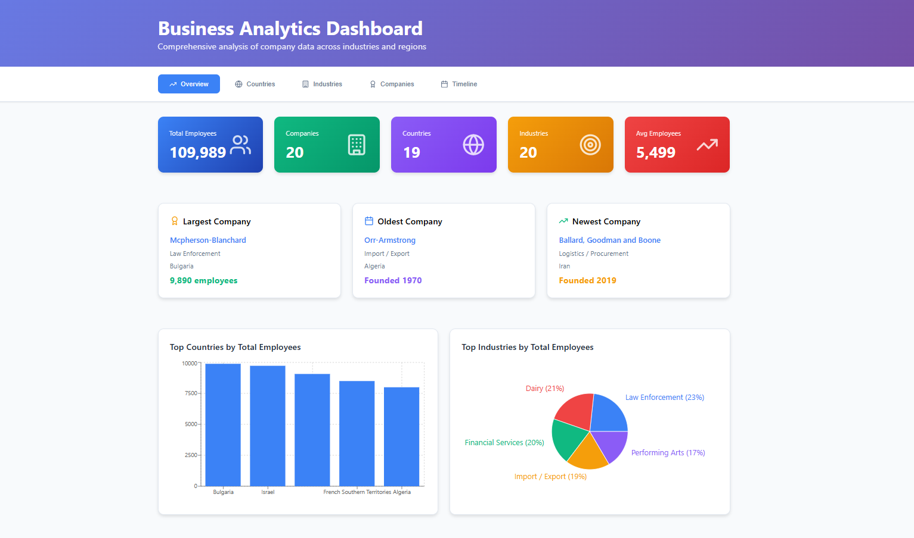
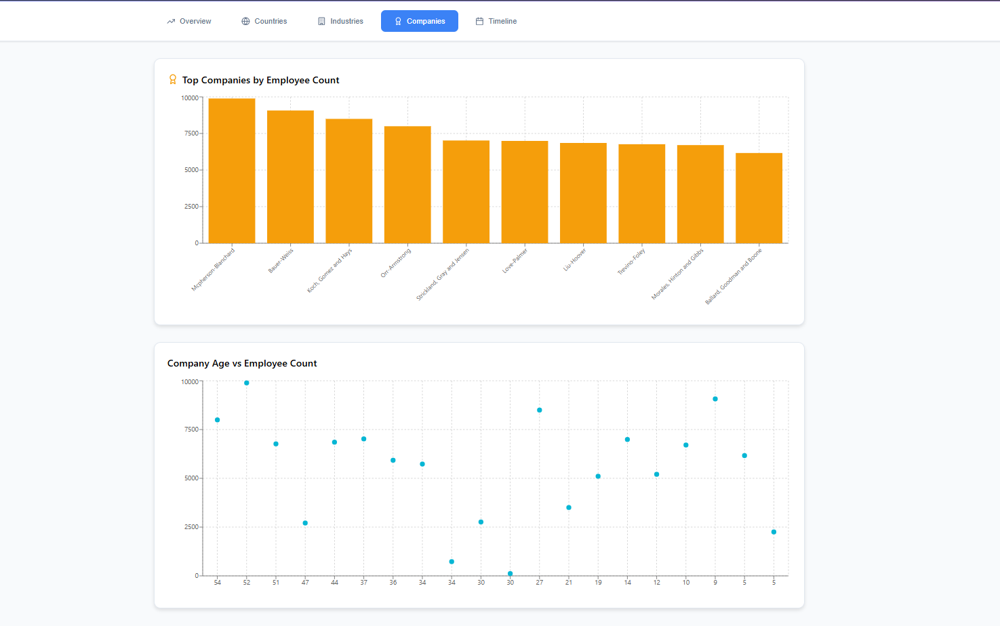
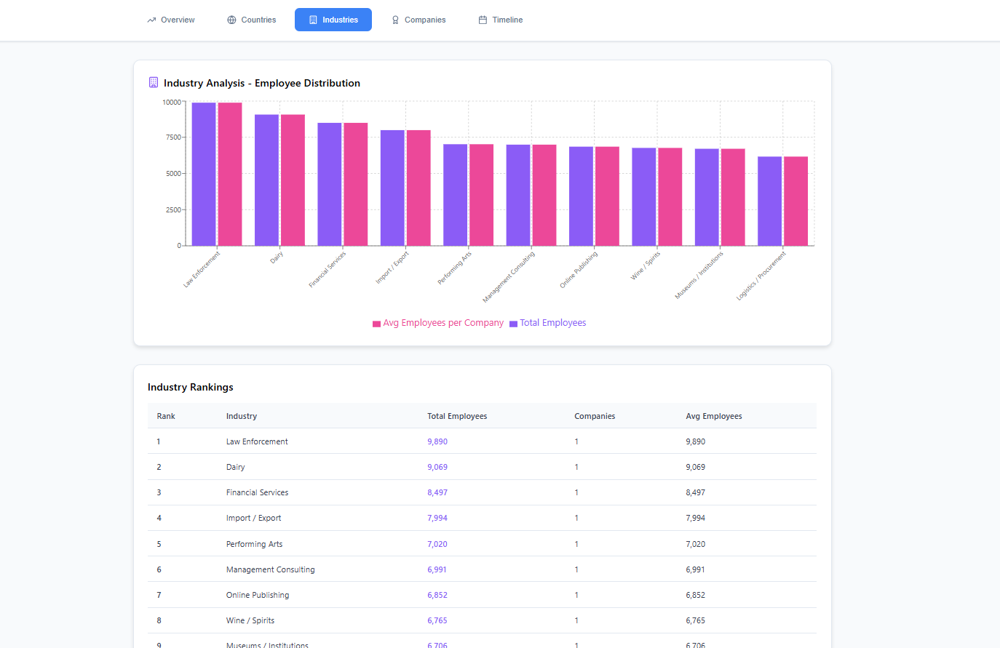
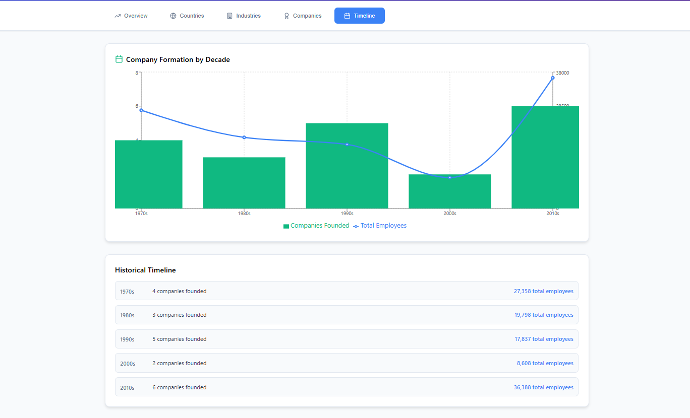
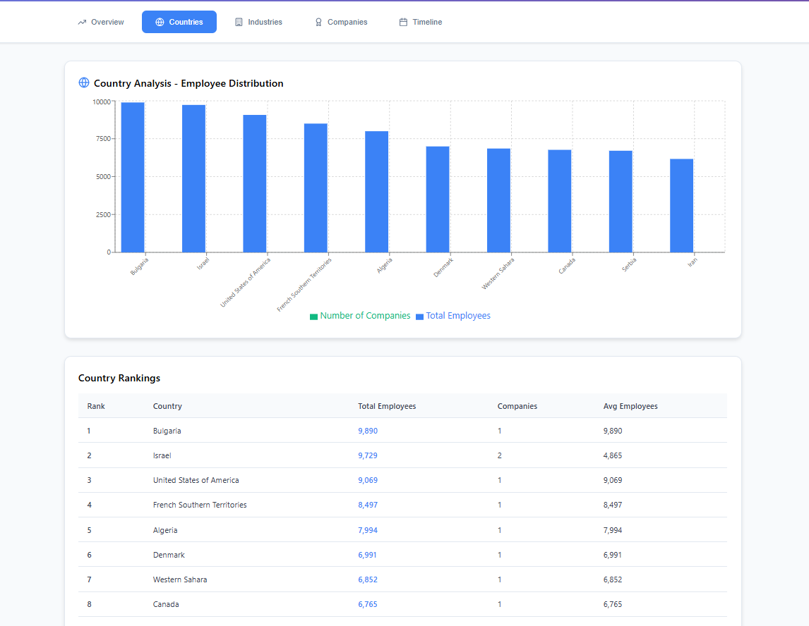

# Introducing Delta


## Overview

Delta is a full-stack business intelligence platform that processes CSV data (default format included in the repo), visualizes it through interactive dashboards, and stores structured data in MongoDB with S3 archiving. While pre-designed for the sample dataset (companies with fields like name, country, employees, etc.), the system is modular—users can adapt the parser and dashboard to their own CSV formats by modifying the schema and visualization logic. Built on the MERN stack with AWS S3 integration, it’s designed for rapid deployment as a scalable analytics MVP.


## Key Features

- **CSV Data Processing**: Parses uploaded CSV files into JSON format
- **Interactive Visualizations**: Multiple chart types (bar, pie, line, scatter)
- **MongoDB Integration**: Stores processed data for persistent access
- **AWS S3 Archiving**: Securely archives original CSV uploads
- **Responsive Dashboard**: Clean, modern UI with multiple analysis views

## Preview Images

| View | Preview |
|------|---------|
| Overview |  |
| Companies |  |
| Industries |  |
| Timeline |  |
| Timeline |  |

## Technology Stack

### Frontend
- React.js
- Vite (for fast development builds)
- Recharts (data visualization)
- Lucide React (icons)

### Backend
- Node.js
- Express.js
- MongoDB (database)
- Mongoose (ODM)
- AWS SDK (S3 integration)
- CSV parser

## Installation

1. Clone the repository:
   ```bash
   git clone https://github.com/zayd100/delta-viz.git
   cd delta-viz
   ```

2. Install dependencies for both frontend and backend:
   ```bash
   # Frontend
   cd frontend
   npm install

   # Backend
   cd ../backend
   npm install
   ```

3. Set up environment variables:
   - Create `.env` files in both frontend and backend directories
   - Include MongoDB connection string and AWS S3 credentials in backend `.env`

4. Start the development servers:
   ```bash
   # In frontend directory
   npm run dev

   # In backend directory
   npm start
   ```

## Usage

1. Upload a CSV file with company data through the web interface
2. The system will:
   - Parse the CSV into JSON format
   - Store the processed data in MongoDB
   - Archive the original CSV in AWS S3
3. Explore the data through the interactive dashboard views:
   - Overview: Key metrics and highlights
   - Countries: Analysis by geographic region
   - Industries: Sector-based insights
   - Companies: Individual company performance
   - Timeline: Historical trends

## Expected CSV Format

The application expects CSV files with the following columns:
- `name`: Company name
- `country`: Country of operation
- `industry`: Industry sector
- `number_of_employees`: Employee count
- `founded`: Year founded

Example row:
```
"Liu-Hoover","Western Sahara","Online Publishing",6852,1980
```

## Acknowledgments

This project was developed with some assistance from AI tools to:
- Optimize certain code segments
- Generate documentation
- Suggest architectural improvements

The core logic, design, and implementation remain human-crafted with AI serving in an advisory capacity.

